# Picasso

- 
- [홈페이지 링크](http://picasso.jong1.com/)

---

## Index

- [Picasso](#picasso)
  - [Index](#index)
  - [주제](#주제)
  - [Git](#git)
    - [브랜치 전략](#브랜치-전략)
    - [Commit Convention](#commit-convention)
    - [Title](#title)
    - [Body](#body)
  - [TechStack](#techstack)
    - [FrontEnd](#frontend)
    - [BackEnd](#backend)
    - [Database](#database)
    - [Tool](#tool)
  - [Architecture](#architecture)
  - [ProtoType Wire Frame](#prototype-wire-frame)
  - [ERD](#erd)
    - [ERD Image](#erd-image)
  - [CI/CD](#cicd)
  - [회고](#회고)
    - [종원](#종원)
    - [세환](#세환)
  - [구현 기능](#구현-기능)
    - [마이페이지](#마이페이지)
    - [경매품 기능](#경매품-기능)
    - [결제](#결제)
    - [발송메일 알림 모습](#발송메일-알림-모습)
    - [스케쥴링](#스케쥴링)
      - [비동기전 동기화 상태의 코드 및 성능](#비동기전-동기화-상태의-코드-및-성능)
        - [시작 데이터 건수](#시작-데이터-건수)
        - [스케쥴링 시작시](#스케쥴링-시작시)
        - [스케쥴링 종료후](#스케쥴링-종료후)
      - [비동기로 변경 후 성능](#비동기로-변경-후-성능)
        - [실행 데이터 2000건](#실행-데이터-2000건)
        - [스케쥴링 시작 전](#스케쥴링-시작-전)

---

## 주제

> [!NOTE]  
> 미술품 경매 사이트

---

## Git

### 브랜치 전략

- `Git Flow`

### Commit Convention

| TagName | Description                               |
| :-----: | :---------------------------------------- |
|  feat   | 기능 개발 및 추가                         |
|   fix   | 버그 수정                                 |
|  docs   | 문서 수정                                 |
|  style  | 기능변경 없이 코드 스타일만 병경하는 경우 |
|  test   | Test코드 작성                             |
|  chore  | 빌드관련작업 전부                         |
| rename  | 파일명 수정                               |

### Title

- 큰 테마로 간단하게만 적도록 합니다.
- `Issue`가 존재하는 경우에는 `Issue Number`를 같이 링크하도록 합니다.

### Body

- `Title`에서 작성한 테마 기능, 또는 작업 내역에 대하여 `무슨 작업`을 `왜?`에 초점을 두어 작성한다.

---

## TechStack

### FrontEnd

### BackEnd

### Database

### Tool

---

## Architecture

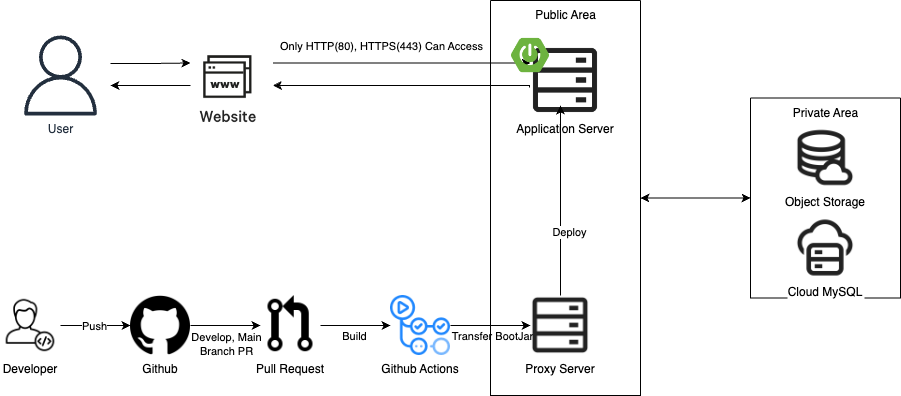

---

## ProtoType Wire Frame

> 초안으로 제작한 WireFrame 다들..그저 BackEnd였다...

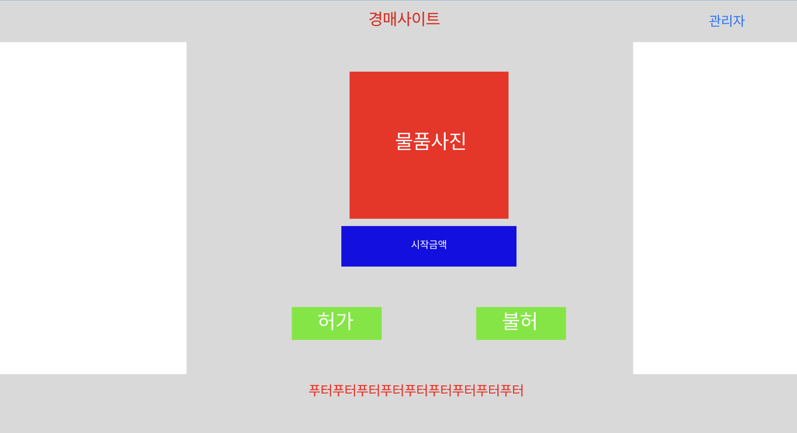
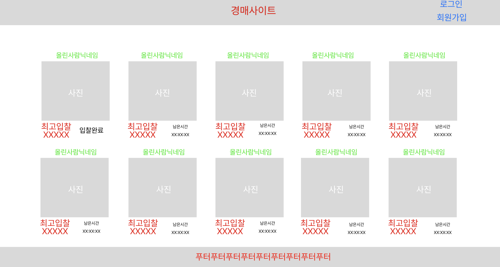
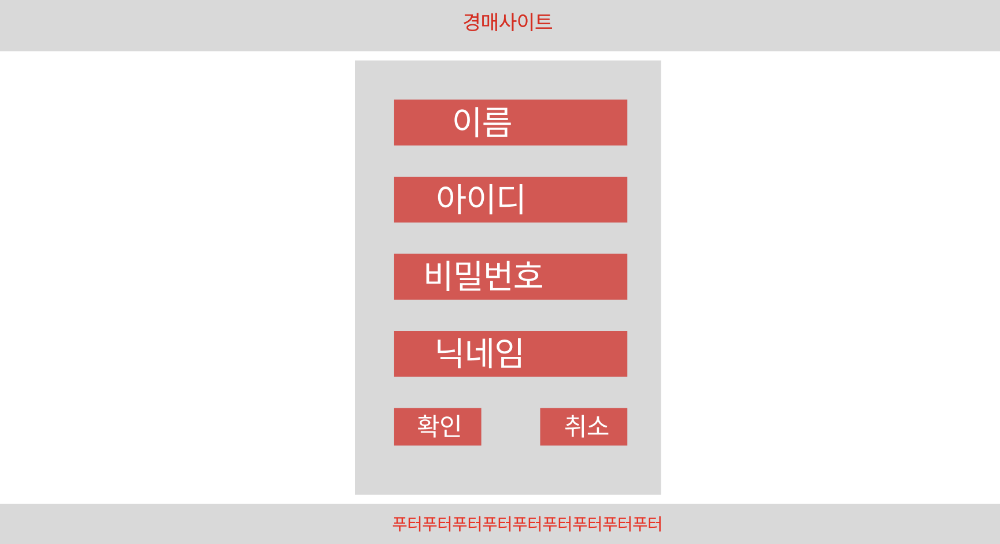
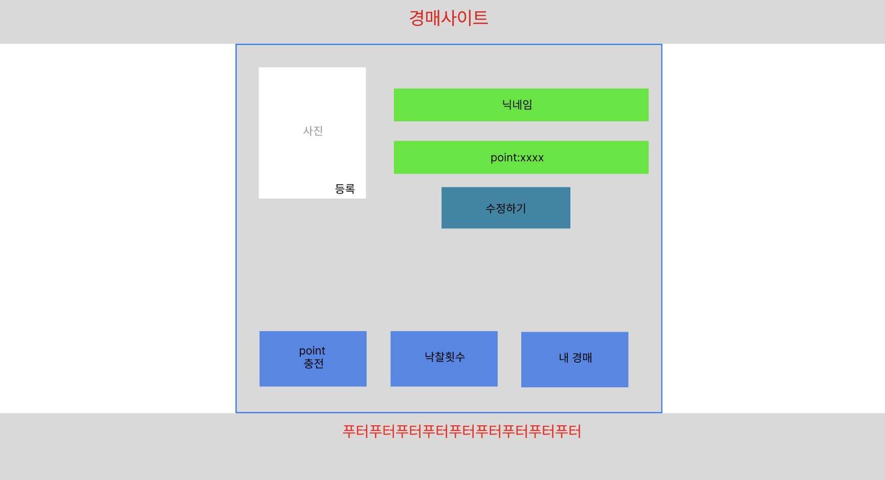
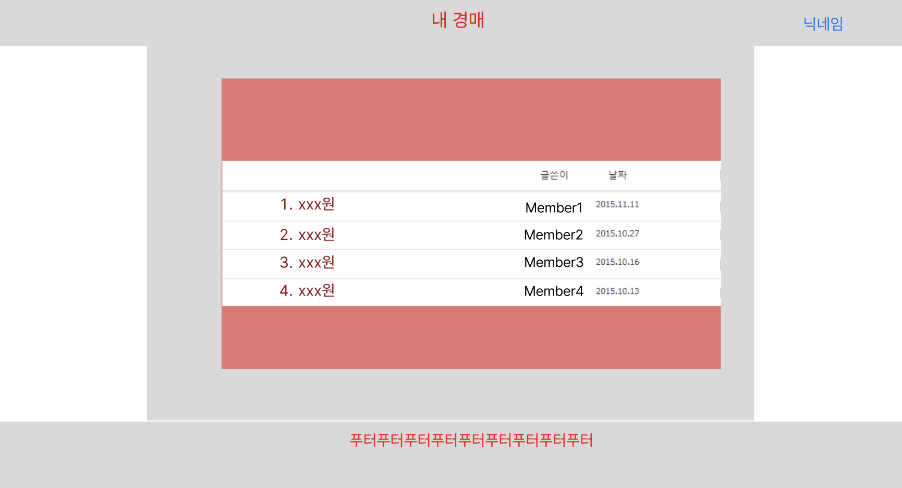

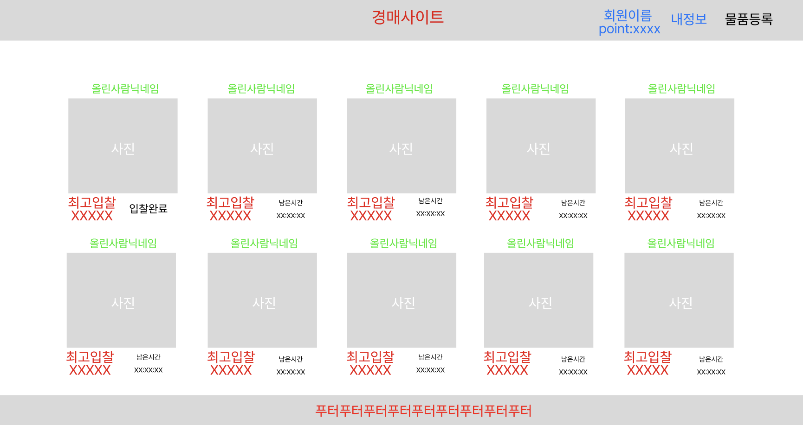
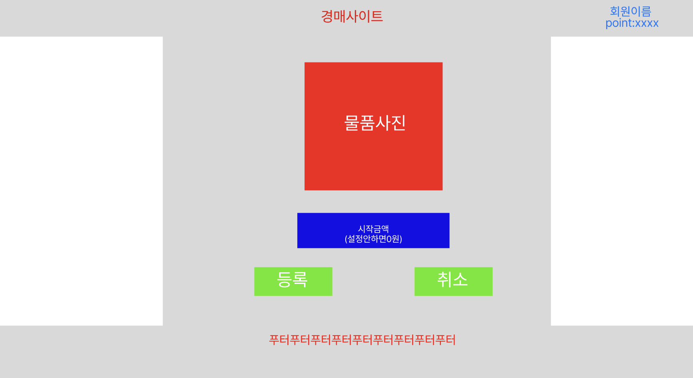
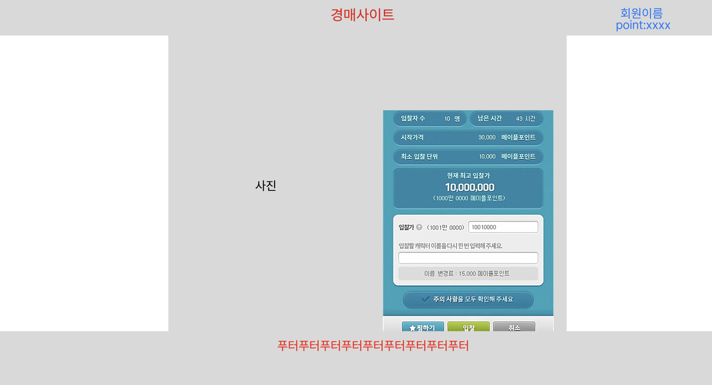

---

## ERD

> [!NOTE]
> DBDocs의 문서화 내용 변경하고싶은 경우  
> `./Docs/Picasso.dbml`의 파일 내용을 변경한 다음 `dev`브랜치에 Push가 진행될 경우 자동 갱신됩니다.

- [DBDocs 링크](https://dbdocs.io/donsonioc2010/Picasso)

### ERD Image

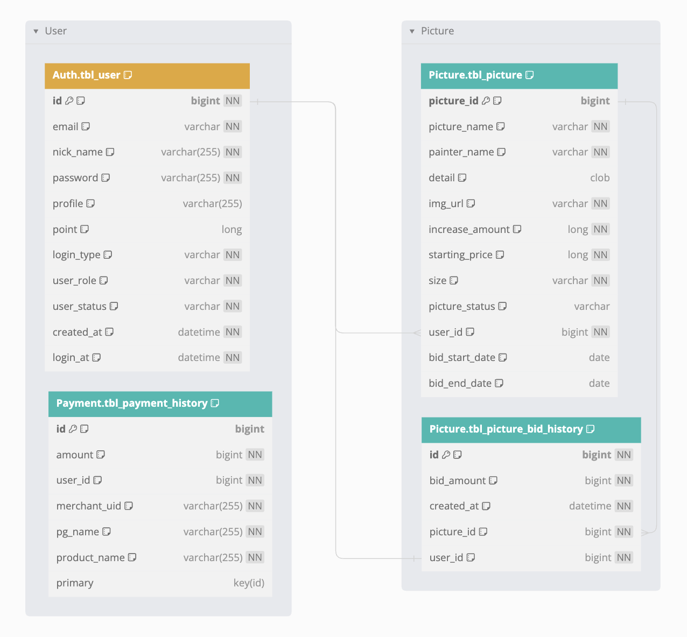

---

## CI/CD

---

## 회고

### 종원

- [프로젝트 개요](https://devjong12.tistory.com/101)
- [와이어프레임](https://devjong12.tistory.com/102)
- [프로젝트의 CI / CD](https://devjong12.tistory.com/103)
- [NCloud ObjectStorage 업로드 공통기능 구현](https://devjong12.tistory.com/104)

### 세환

- [프로젝트 개요](https://dev-sh-bong.tistory.com/6)
- [CI와 CD, DBDocs의 CD구축](https://dev-sh-bong.tistory.com/7)

---

## 구현 기능

### 마이페이지

### 경매품 기능

### 결제

> 결제의 경우 실제 개발자 테스트계정이기 떄문에 로직 개발이 완료된 부분까지만 진행하였습니다.

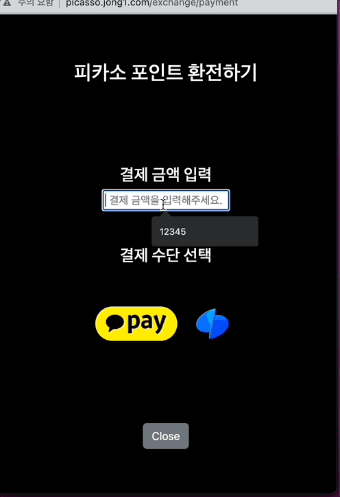

### 발송메일 알림 모습

### 스케쥴링

#### 비동기전 동기화 상태의 코드 및 성능

> 해당 로직에서 실제 많은 시간이 소요되는 것을 볼 수가 있다.

##### 시작 데이터 건수

##### 스케쥴링 시작시

##### 스케쥴링 종료후

#### 비동기로 변경 후 성능

> 0초...!

##### 실행 데이터 2000건

##### 스케쥴링 시작 전

> 실행과 동시에 데이터가 바뀌면서 종료되고 메일메소드 기능이 실행된다.

